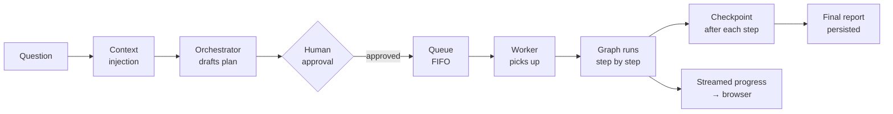

# Chapter 1 · Problem, Design Decisions, and Implementation Plan

Start with the problem, not the framework.

A user asks a business question. The system should produce a sourced research report. Before it calls expensive tools, a human should see and approve the plan. The work may take forty minutes. The browser may disconnect. A worker may crash halfway through. A second worker should resume without duplicating the report.

That is the system we are building in this series.

It is not a chatbot, not a prompt wrapper, and not an API handler that calls a model and returns. It is a **distributed system with an agent inside it**.

## The problem

The dangerous failure mode is not a crash. The dangerous failure mode is this:

```text
HTTP request: 200 OK
Logs:         normal
User sees:    plausible report
Reality:      wrong country, duplicated work, stale context, or invented number
```

This is the distinction the whole series turns on:

```text
Transport success:
  the request finished

Semantic success:
  the right context, state, plan, lock, persistence, and provenance rules held
```

An ordinary API often lets you treat those as the same thing. A production deep agent does not.

## The design decisions

The implementation follows six decisions. Each later chapter turns one of them into code.

1. **Make state durable.** The run must survive a different request, worker, or deploy.
2. **Inject context at a controlled boundary.** The model needs user and business context, but stale context must not leak into later phases.
3. **Plan before execution.** The model drafts an inspectable plan, and a human approves it before expensive work begins.
4. **Name every moving part.** A thread, plan, interrupt, run attempt, stream event, lock tenure, and retrieved fact are not the same thing.
5. **Separate progress from truth.** SSE is for narration. Checkpoints and run-state are the durable source of truth.
6. **Use code for boundaries and prompts for judgment.** Code enforces approval, tools, locks, and ownership. The prompt shapes planning, grounding, and reasoning order.

## The implementation plan

We will build the system in this order:

```text
1. End-to-end architecture and orchestrator flow
2. State and checkpoints
3. Context injection
4. Planning and human approval
5. Identifiers
6. Streaming and background work
7. Distributed locks
8. Queue and worker execution
9. Orchestrator prompt
10. Capstone review
```

The order matters. Identifiers make more sense after you have seen a plan pause and resume. Locks make more sense after the browser can double-click approval. Prompt design makes more sense after code already owns the boundaries.

## The lifecycle of a single run

Here is the full system we are going to build:



Here is what happens at each stage — and what is at stake at each boundary.

**Question.** The user's intent arrives as text. It is not yet enough to act on — the agent needs to know who the user is, what they are permitted to see, what defaults apply to their account.

**Context injection.** Before any model call, the system attaches what the model cannot derive from the message alone: account context, user permissions, locale, relevant business rules. The seam between "what the user typed" and "what the system added" must be deliberately managed. [Step 2](03-context-injection.md) covers this.

**Orchestrator drafts a plan.** The model reads the enriched question and produces a structured, inspectable sequence of steps — not "do research," but "query this source, verify that figure, draft this section" — in terms a human can read and evaluate. [Step 3](04-planning-and-human-approval.md) covers this together with approval.

**Human approval.** The plan pauses at a gate. A human reads it and approves or rejects it. Only after approval does any expensive execution begin. This single gate means the run spans two or more HTTP requests, not one. [Step 3](04-planning-and-human-approval.md) covers this.

**Queue.** The approved plan is handed to a FIFO queue, keyed on the conversation thread. The API process returns immediately; the queue holds the intent durably until a worker is ready. [Step 7](08-queue-and-worker-execution.md) covers this.

**Worker.** A background worker dequeues the job and begins executing the plan. The worker is independent of the API process — it may run on a different machine, across a deploy boundary, or restart after a crash without the user knowing anything changed. [Step 7](08-queue-and-worker-execution.md) covers this.

**Graph runs step by step.** The worker runs the plan as a LangGraph graph — one node per step. Each node reads from state, does its work, and writes results back. [Step 1](02-state-and-checkpoints.md) covers how that state works.

**Checkpoint after each step.** After every node, LangGraph persists a checkpoint: a complete snapshot of state at that point. If the worker crashes at step 4, a new worker reads the checkpoint and resumes from step 4 — not from the beginning. [Step 1](02-state-and-checkpoints.md) covers checkpoints.

**Streamed progress → browser.** As the graph runs, it emits progress events over SSE (server-sent events). The browser shows the report being built section by section. But the SSE connection is ephemeral — closing the browser must not stop the work. [Step 6](06-streaming-and-background-work.md) covers this.

**Final report persisted.** When the graph completes, the finished report is written to durable storage. The user can reload, share the link, or return a week later.

## What makes this a distributed system

Each stage of the lifecycle runs in a different context:

- The **API process** handles the question and the approval.
- The **queue** holds intent across process boundaries.
- The **worker** executes the plan.
- The **checkpoint store** persists state across crashes and deploys.
- The **SSE stream** connects the browser to live progress without keeping the work alive.

This is what the standard tutorial loop — call model, run tool, return answer — does not show. When work must outlive the request that started it, you are no longer writing a request handler. You are operating a small distributed system, and every boundary between those components is a place where state can be lost, duplicated, or corrupted while every individual component still reports success.

That failure mode — `200 OK`, wrong answer — is what the rest of this series teaches you to prevent.

---

!!! check "You should now understand"
    - The production problem this series solves
    - Why a deep agent is a distributed system with an agent inside it
    - The design decisions that shape the implementation
    - The step-by-step build plan for the rest of the chapters
    - Why `200 OK` and "the work was correct" are not the same thing

??? question "Try this"
    **Your team builds a request handler that calls an LLM, lets it pick tools, and returns the result — all in one HTTP request. They want to add human approval before any expensive tool runs. A colleague says: "Easy, just interrupt the function, wait for the approval callback, then resume." What breaks with that design, and what has to change?**

    ??? success "Answer"
        The approval can take minutes or days — a human reads and approves asynchronously. Holding an HTTP connection open that long is not possible in practice (timeouts, load balancers, client disconnects). Approval changes the system topology: the first request produces the plan and returns; the human approves out-of-band; a second request resumes the run. This requires (1) durable checkpointed state so any replica can pick up the run, (2) a pause mechanism (`interrupt()`) that serializes the graph to storage rather than blocking a thread, and (3) a separate resume endpoint that delivers the human's decision. The single-function model doesn't survive crossing an HTTP boundary.

*Next: [Chapter 2 · End-to-End Architecture and Orchestrator Flow](02-end-to-end-architecture-and-orchestrator-flow.md) — the whole production path before we zoom into each mechanism.*
