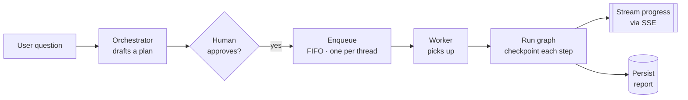

# What a Deep Agent Is

You have built web APIs before. A request comes in, you do some work, you return a response. When something goes wrong you get a `500` and a stack trace, and the stack trace tells you where to look.

A deep agent breaks differently. The request returns `200 OK`, the logs show a clean path, latency looks normal — and the answer is wrong. Nobody gets paged. The dashboards stay green. A user reads a plausible, confident, incorrect report and acts on it.

That failure mode is the reason this series exists. To understand why it happens, you first have to see what a deep agent actually *is* — because it is not the thing most tutorials show you.

> New to the vocabulary? Every term is defined once in the [glossary](00-glossary.md), and each article links there on first use.

## A deep agent is a distributed system, not a prompt around a model

The tutorial picture of an "agent" is a loop: call the model, run a tool, feed the result back, repeat, return the answer. That fits in one function and lives entirely inside one HTTP request.

A production agent does not fit in one request. Its work is *long* (tens of minutes), *interruptible* (a human approves a plan partway through), and *durable* (it must survive a deploy, a crash, and a user who closes their laptop). The moment work has to outlive the request that started it, you are no longer writing a request handler. You are operating a small distributed system with these parts:

- **[State](00-glossary.md#state)** the agent accumulates as it works — not local Python variables, but durable data.
- **[Checkpoints](00-glossary.md#checkpoint)** that snapshot that state after each step, so a run can be reconstructed by any process.
- **A [plan](00-glossary.md#plan-plan_id-interrupt_id)** the model drafts, and a human [gate](00-glossary.md#gate) that approves it before anything expensive runs.
- **A [queue](00-glossary.md#fifo-queue) and a worker** — the approved plan is handed off to a background worker that executes it, not the API process.
- **[Locks](00-glossary.md#lease)** so two workers never corrupt the same run.
- **[Streams](00-glossary.md#sse-server-sent-events)** (SSE) that push progress to the browser while the work runs elsewhere.

Here is the life of a single run, end to end. The rest of the series builds it one piece at a time, in this order:



Every arrow in that diagram is a boundary where state crosses from one process, request, or storage layer to another. Every boundary is a place the meaning of the run can be dropped, duplicated, or overwritten while the transport still reports success.

## The one distinction the whole series turns on

Ordinary APIs let you conflate two things that a deep agent forces apart:

```text
Transport success:  the HTTP request finished — 200 OK
Semantic success:   the right context, state, plan, lock, and
                    persistence rules all actually held
```

In a plain CRUD endpoint these usually rise and fall together: if the write succeeded, the work was done. In a deep agent they come apart constantly. The HTTP request can finish perfectly while the background work it kicked off gets cancelled, while a stale checkpoint overwrites a fresh one, while the wrong context is attached to the model, while two workers both think they own the run. Transport says `200`. Semantics are corrupt.

This is the definition of a **[silent failure](00-glossary.md#transport-success-vs-semantic-success)**, and it is the class of bug this series teaches you to see and prevent.

## What is new compared to an ordinary API

If you already build web services, here is the extra failure surface — the things that are simply not present when a request begins and ends in one function:

- **State outlives the request.** It lives in durable storage and is read back by processes that never saw the original request.
- **There are multiple [replicas](00-glossary.md#replica).** The process that resumes a run is usually not the one that started it, so nothing correct may depend on in-memory state.
- **Runs pause and resume.** A run stops at a [gate](00-glossary.md#gate), waits for a human, and continues later — possibly on another machine, after a deploy.
- **Streaming ends early.** An [SSE](00-glossary.md#sse-server-sent-events) connection can close before the server has safely persisted its work.
- **Work runs concurrently.** Retries, double-clicks, and redeliveries mean the same run can be attempted more than once, so operations must be [idempotent](00-glossary.md#idempotency) and guarded by [locks](00-glossary.md#lease).

Every article in this series is really about one of these five boundaries.

## How to read this series

The series is ordered the way you would actually **build** the system, not as a catalog of bugs. Read it in order:

**Part 0 — Design foundation.** You are here. Then:

1. [LangGraph State](03-langgraph-state.md) — how the agent holds state, and how a graph can run while silently losing data between nodes.
2. [Context Injection](02-context-injection.md) — getting the right context to the right boundary; the wrong context at the wrong seam answers wrong while looking fine.

**Part 1 — Async tasks that run.**

3. [SSE & Background Tasks](04-sse-cancellation.md) — making a run outlive the HTTP request, so a client disconnect cannot cancel work you still need.

**Part 2 — Plan → SQS → worker.**

4. [The Orchestrator Prompt](09-designing-the-orchestrator-prompt.md) — the model produces the plan; the prompt shapes judgment while code enforces boundaries.
5. [Human-in-the-Loop Approval](08-human-in-the-loop-plan-approval.md) — the gate that shows the plan to a human before anything expensive executes.
6. [Distributed Locks](05-distributed-locks.md) — a lease and a tenure token so only one worker owns a run, and what a safe takeover looks like.
7. [Durable Async Runs](07-durable-async-agent-runs.md) — persist intent, enqueue to a FIFO queue, one worker per thread, and resume a run on a different worker after a crash.

**Part 3 — Capstone.**

8. [Nine Silent Failures](06-nine-silent-failures-langgraph-research-agent.md) — nine of these bugs caught in code review before shipping one real LangGraph research agent.

## The habit that catches most of these bugs

You do not need to be a LangGraph expert to start. You do need to carry four facts with you into every code sample:

- A graph run can pause and resume later from a [checkpoint](00-glossary.md#checkpoint).
- Agent state is durable data, not local Python variables.
- Streaming HTTP can end before all server-side work is safely persisted.
- Distributed coordination must survive multiple API [replicas](00-glossary.md#replica) and retries.

And one question, asked of every function you read: **what state had to be true before this ran, and what state must be true after it finishes?** That question — not any particular API — is what catches silent failures.
