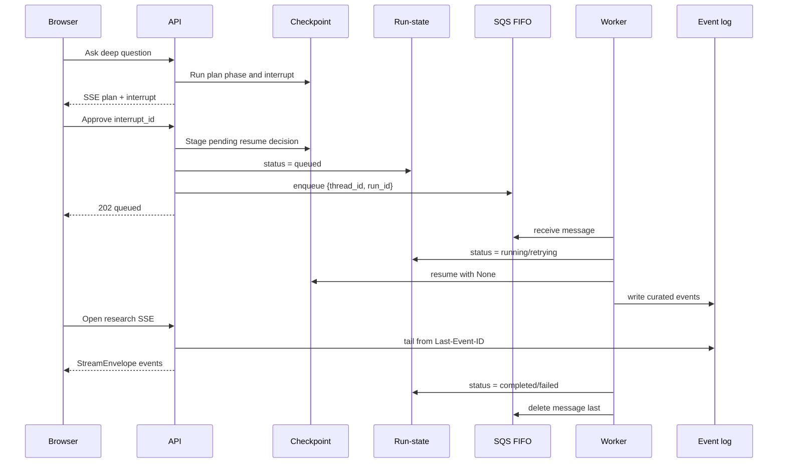

# Chapter 2 · End-to-End Architecture and Orchestrator Flow

Before building state, prompts, queues, or locks one at a time, hold the whole run in your head.

A production deep agent is not one request that calls a model. It is a handoff chain:

```text
API plans -> checkpoint pauses -> human approves -> API queues -> worker resumes -> SSE tails events
```

Each arrow crosses a seam where a silent failure can enter. This chapter gives you the map so the implementation chapters have somewhere to attach.

## The four durable records

One approved research turn has four different records, with four different jobs:

| Record | Job | Who reads it |
|---|---|---|
| Checkpoint | Graph truth: state, pending interrupt, pending resume decision | LangGraph and approval validation |
| Run-state | Durable lifecycle: `queued`, `running`, `retrying`, `completed`, `failed` | API, worker, SSE tail, failure detector |
| Queue message | A tiny pointer: `thread_id`, `run_id` | Worker |
| Event log | Curated progress feed for humans | Browser SSE tail |

The checkpoint is the graph's source of truth. The event log is narration. The queue is only a pointer. Run-state is the lifecycle marker that lets the UI stop waiting when work completed or failed.

If you blur these together, the system becomes hard to repair after a crash. A lost event should not lose the run. A lost queue message should be re-enqueueable. A completed worker should not need a live browser to make completion true.

## The deep-agent package map

The codebase mirrors those records and phases. In the production implementation, `agent/deep/` was not one giant "agent" file; it was a set of small modules grouped by job:

| Group | Modules | Responsibility |
|---|---|---|
| Graph and control flow | `graph.py`, `gate.py`, `plan.py`, `contract.py` | Assemble the graph, own the plan approval gate, project todos into a typed plan, and centralize shared tool/node names. |
| Middleware | `proposal_context.py`, `manifest.py`, `sufficiency.py`, `retrieval_budget.py`, `exit_path.py` | Inject user context, render held data, check sufficiency, meter retrieval depth, and generate the report at exit. |
| Execution and analysis | `analyst.py`, `interpreter.py` | Run bounded code-analysis loops outside the quick answer path. |
| Async worker plumbing | `run_queue.py`, `run_state.py`, `worker_lock.py`, `resume_claim.py`, `resume_decision.py`, `checkpointer.py`, `token_escrow.py` | Enqueue approved work, track attempts, fence workers, prevent double resume, persist the resume decision, share checkpoints, and let workers authenticate to data sources. |
| Event feed | `curator.py`, `event_log.py`, `events_table.py` | Turn raw graph events into stable UI frames and write them idempotently for the SSE tail. |
| Provenance, citations, and charts | `provenance.py`, `citations.py`, `chart_tool.py`, `chart_state.py`, `chart_anchors.py`, `chart_adapter.py` | Name each retrieval, attach citations and cards to the right evidence, and keep chart specs tied to the report cycle. |
| Prompts | `prompts/orchestrator_prompts.py`, `report_prompts.py`, `sufficiency_prompts.py`, `analyst_prompts.py` | Shape planning, reporting, sufficiency grading, and code-analysis behavior. |

This map is a design guardrail. `graph.py` assembles the system, but it should not own every policy. The gate owns approval, the middleware owns loop and exit behavior, worker modules own durable execution, and provenance modules own attribution. When a bug crosses one of those boundaries, it usually means the responsibility landed in the wrong group.

## Phase 1: planning runs in the API

The first request starts from a user question.

```text
POST /chat/stream?mode=deep
  -> build graph input for this turn
  -> inject user context at model-call time
  -> orchestrator writes todos
  -> submit_plan projects a typed plan
  -> interrupt() persists the pause
  -> API streams a plan event and closes at interrupt
```

The plan phase is allowed to be synchronous because it ends quickly at the gate. The browser watches it over SSE, but the important artifact is the checkpoint: it now contains state plus a pending interrupt payload.

The `submit_plan` tool is deliberately split by concern:

- The plan's step structure is derived from the agent's `write_todos` state.
- The resolved entities arrive as an explicit `entities` tool argument.
- The gate sanitizes those entities and persists them to `state["entity_groups"]`.

That split matters. The model authors the raw planning intent. Code projects and sanitizes the approved shape.

## Phase 2: approval stages intent, then queues work

Approval is not where research execution happens in the production path.

```text
POST /deep/{thread_id}/approve/async
  -> read pending interrupt from checkpoint
  -> validate owner, plan, and interrupt
  -> saver.put_writes((RESUME, {"type": "approve"}), task=NULL_TASK_ID)
  -> put run-state: status = queued
  -> enqueue SQS FIFO message, MessageGroupId = thread_id
  -> return 202 queued
```

The resume decision is not a normal state field. It is not `LastValue`, and it is not a reducer. It is a LangGraph pending write placed in the checkpoint's resume slot so the paused `interrupt()` can consume it later.

The write order is the contract:

```text
checkpoint resume decision -> run-state queued -> queue message
```

A queue message can be re-sent. A human approval decision cannot be reconstructed safely after the fact, so it is written first.

An earlier design had the approve request itself stream execution synchronously in the HTTP response — useful for local testing, but not the production target. The production path returns `202 queued` and lets a separate background worker own the long run.

## Phase 3: the worker resumes with no input

When the worker receives the FIFO message, it already has everything it needs.

```text
SQS receive
  -> stamp attempt/receive count into run-state
  -> acquire lock#{thread_id}
  -> compile graph with a lease-extending saver
  -> agent.astream_events(None, config)
  -> curate raw events into StreamEnvelope
  -> write terminal run-state
  -> release lock
  -> delete SQS message last
```

The `None` is not a placeholder. It is the design. Approval was already staged in the checkpoint as a pending resume write, so LangGraph reloads the checkpoint, re-enters the paused `interrupt()`, drains the pending resume value, and continues.

Deleting the SQS message is last because loss is worse than duplication. If the worker crashes before terminal status, the message redelivers and another worker resumes from the checkpoint.

## Phase 4: the browser tails a projection

The frontend should never consume raw LangGraph or DeepAgents events. Those are framework internals. The UI gets a curated `StreamEnvelope`.

The two phases use different streaming paths:

```text
PLAN PHASE
──────────
  Browser ←── SSE ←── API (curator runs here, inline)

RESEARCH PHASE
──────────────
  Worker (curator runs here)
      │
      │  writes curated events
      ▼
  DynamoDB event log
  (one row per event, keyed by thread_id + seq)
      │
      │  browser polls: "give me rows where seq > my Last-Event-ID"
      ▼
  API SSE tail endpoint
      │
      ▼
  Browser
```

During research, **the API and the worker never talk to each other directly.** The worker writes to the event log. The API reads from it. The browser's `Last-Event-ID` header is the cursor — if the browser reconnects after a network blip, it sends the last `seq` it saw, and the API picks up from there. No events are lost.

Termination is status-based, not sentinel-based:

```text
Browser asks: "are we done?"
API checks: run-state record in database

  if status == "running"  → keep tailing the event log
  if status == "completed"  → send terminal frame, close stream
  if status == "failed"     → send terminal frame, close stream
```

```python
if run.status in ("completed", "failed"):
    yield terminal_frame(run.status)
    return
```

Do not rely only on a final `done` event. A crash can skip a sentinel. A run-state record can still be flipped to `failed` by a worker, redelivery path, or detector, letting the browser stop with a visible reason.

## The orchestrator's real tool surface

The public lessons sometimes use `query_source` as a teaching simplification. The production shape is richer: the orchestrator had seven allowed tools.

```text
write_todos
submit_plan
query_cortex
query_iqvia_gmi
run_analysis
rebuild_artifacts
read_file
```

The important boundary is not the exact names. It is the allow-list: only plan-safe planning tools are reachable before approval, and only plan-gated retrieval or synthesis tools are reachable after approval. Sub-agent tools are not directly reachable by the orchestrator.

## The whole run



The rest of the series now zooms into each box: state, context, approval, identifiers, streams, locks, queue execution, prompt design, and the failure modes that happen when any seam lies.

---

!!! check "You should now understand"
    - Why production approval queues work instead of streaming execution inside the approval request
    - Why the resume decision lives in checkpoint pending writes, not in ordinary state
    - Why the worker resumes with `None`
    - Why checkpoints, run-state, queue messages, and event logs are separate records
    - Why raw framework events are curated before the frontend sees them

??? question "Try this"
    **The approval endpoint has validated the pending interrupt. Should it call the graph with `Command(resume={"type": "approve"})` and stream research work to the browser, or should it write the resume decision, queue the run, and return?**

    ??? success "Answer"
        In the production path, it writes the resume decision into the checkpoint, writes run-state as `queued`, enqueues the FIFO message, and returns `202 queued`. A worker later resumes the graph with `None` because the decision is already staged in the checkpoint.
