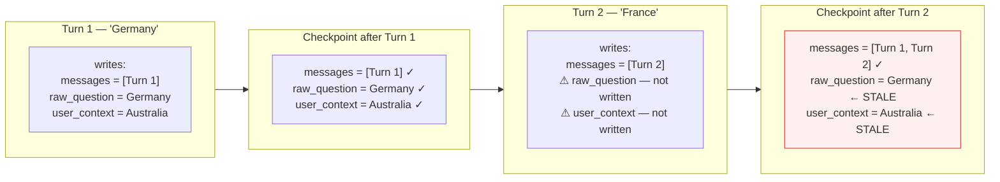

# Step 1 · State and Checkpoints

A user asks, "What were sales in France?" The agent answers with a confident, well-formatted report — about **Germany**. The request returned `200 OK`. No error, no retry, no log line out of place. The previous question in that conversation had been about Germany, and somehow it leaked into this turn.

This is the most common silent failure in a LangGraph agent, and it is never a bug in your node logic. It is a bug in how [state](00-glossary.md#state) carries over between turns. To see why, you have to know the one rule that governs every value your graph stores.

> Key terms — [state](00-glossary.md#state), [channel](00-glossary.md#channel), [LastValue](00-glossary.md#lastvalue-the-footgun), [checkpoint](00-glossary.md#checkpoint) — are defined once in the [glossary](00-glossary.md).

## The mental model: state is a dictionary with a rule per key

LangGraph state is a dictionary. What makes it different from a plain dict is that **each key has a rule attached** — a [channel](00-glossary.md#channel) — that decides what happens when a node writes to it.

The default rule is [`LastValue`](00-glossary.md#lastvalue-the-footgun): the latest write replaces the previous value. That sounds harmless until you notice its other half:

> If a new run does **not** write a key, `LastValue` keeps whatever the [checkpoint](00-glossary.md#checkpoint) already had.

That is the trap, and it is worth saying slowly: **"I did not write this key" does not mean "clear this key." It means "keep the old value."** In an ordinary request handler, a variable you don't set is empty. In a checkpointed graph, a key you don't write is *stale*.

Here is the France/Germany bug as a state trace:

```text
Checkpoint before the new turn
  raw_question = "sales in Germany"
  user_context = "default country: Australia"

New graph input (this turn)
  messages = ["sales in France"]

Checkpoint after the input is merged
  messages      = previous messages + ["sales in France"]
  raw_question  = "sales in Germany"            <- STALE, never rewritten
  user_context  = "default country: Australia"  <- STALE, never rewritten
```

The caller wrote `messages` and nothing else. `add_messages` appended the new message correctly — but `raw_question` and `user_context` still hold last turn's values, because nobody overwrote them. A downstream node reads `raw_question`, sees "Germany," and does exactly what it was told.



**The fix is one sentence:** if a key must describe *this* turn, the caller must write it *every* turn. Everything below is how to make that discipline hard to get wrong.

## State versus checkpoint

Two words that sound the same and are not:

- **State** is the logical data your graph reads and writes during a run.
- **[Checkpoint](00-glossary.md#checkpoint)** is the durable stored copy that lets LangGraph resume the run later — possibly in a different process, after a deploy.

```text
node returns {"plan": plan_dict}
  → LangGraph applies the channel rule for each key
    → checkpointer stores a durable snapshot
      → a later HTTP request resumes with the same thread_id
        → LangGraph reloads state from the checkpoint
```

A checkpoint holds more than the final visible state. During an [`interrupt()`](00-glossary.md#interrupt) it also records pending writes and the interrupt payload needed to resume — which is why the stale-value problem survives across pauses, not just across turns.

There is one subtle exception to the channel model: a human resume decision is staged as checkpoint plumbing, not as normal state. In the production approval path, the API writes `(RESUME, {"type": "approve"})` into LangGraph's pending-writes area with `saver.put_writes()`. That value is neither `LastValue` nor a reducer; it is a one-shot resume value drained when the worker re-enters the paused `interrupt()`.

## Channel types: replace versus combine

You choose the rule per key. There are two you will use constantly:

- **`LastValue`** — one current value. The active plan, the current raw question. New write replaces old.
- **Reducer channels** — values that should *combine* across writes. Message history uses `add_messages` so new messages **append** instead of replacing the whole list.

```python
class DeepState(TypedDict):
    plan: NotRequired[dict[str, Any]]        # LastValue: replace
    entity_groups: NotRequired[list[dict[str, str]]]  # LastValue: full-list swap
    raw_question: NotRequired[str]           # LastValue: replace
    user_context: NotRequired[str]           # LastValue: replace
    messages: Annotated[list[AnyMessage], add_messages]  # reducer: append
    source_results: Annotated[list[SourceResult], operator.add]  # reducer: append
    step_status: Annotated[dict[str, str], operator.or_]  # reducer: merge
```

Rule of thumb: reach for `LastValue` **only** when stale carry-over is genuinely acceptable, or when every new turn is guaranteed to write an explicit replacement. If you cannot guarantee that, you have a France/Germany bug waiting to happen.

## Turn the convention into an API

The discipline "write these keys every turn" is a convention, and conventions rot — every new endpoint is a chance to forget one. So don't let endpoints hand-build graph input. Put the required keys behind one factory:

```python
def build_proposal_graph_input(question: str, user_context: str) -> dict:
    return {
        "messages": [{"role": "user", "content": question}],
        "raw_question": question,
        "user_context": user_context,
    }
```

The fix is the `raw_question` line:

```python
"raw_question": question,
```

That line must run for every new user turn. Without it, the new message is appended to `messages`, but the old `raw_question` stays in the checkpoint.

Here is the bug and the fix side by side:

```python
# BUG: only writes the chat transcript.
# raw_question silently remains whatever the previous turn wrote.
graph_input = {
    "messages": [{"role": "user", "content": question}],
}
```

```python
# FIX: write every turn-scoped LastValue field on every turn.
graph_input = {
    "messages": [{"role": "user", "content": question}],
    "raw_question": question,
    "user_context": user_context,
}
```

Now the convention is an API. A reviewer checks one function instead of searching every route that starts the graph, and a forgotten key becomes impossible rather than merely unlikely.

## What actually goes wrong

The problem is rarely that state is *absent*. Far more often, state exists but has the wrong **shape, lifetime, or merge semantics**. Watch for:

- Treating an omitted key as if it clears prior state (the France/Germany bug).
- A channel that should merge but uses `LastValue`, so writes clobber each other.
- A sticky `LastValue` channel, such as `plan`, being re-persisted on a later turn even though it was minted for an older `deep_run_id`.
- Confusing checkpoint pending writes with ordinary state fields. The approval decision is staged beside state so a worker can resume with no input; it should not appear in `get_state().values`.
- Multiple nodes writing the same key with incompatible assumptions.
- Mutable objects shared across parallel branches, mutated in place.
- Channel declaration, initialization, and consumption split across unrelated files, so no one place shows the full contract.

## Guardrails for review and tests

- Use a clearly typed state model, and keep durable state separate from ephemeral execution metadata.
- Review channel **merge behavior** as part of code review, not just the node logic.
- Add tests that assert how state evolves across *multiple* node transitions — not a single call.
- Add the test that catches this whole class: a **second turn that intentionally passes empty context**, asserting no value from the first turn survives.

---

State is where the agent's mind lives. The next step, [Context Injection](03-context-injection.md), is about a specific, high-stakes case of getting values into that state: attaching the *right* context to the model at the *right* boundary — and how the wrong context, like a stale `user_context` above, produces an answer that looks fine and is wrong.

---

!!! check "You should now understand"
    - Why `LastValue` channels keep stale data when a key is not written in a new turn — "omitted ≠ cleared"
    - The difference between *state* (the data your graph reads and writes) and *checkpoints* (the durable snapshot that survives crashes and deploys)
    - How to prevent stale carry-over: every turn-scoped key must be written explicitly on every turn
    - Why a resume decision is checkpoint pending-write plumbing, not a state channel
    - Why "write required keys through one factory function" is an API, not a convention — and why the distinction matters in review

??? question "Try this"
    **A node reads `raw_question` from state, uses it to query an external data source, and writes the result back to state. On turn 2, a new engineer updates the endpoint so `raw_question` is only included in the graph input when the user explicitly sends it. On turns where the user doesn't send it, the field is omitted. What is the failure mode, and how do you catch it in a code review?**

    ??? success "Answer"
        `raw_question` is a `LastValue` channel. Omitting it on turn 2 does not clear it — it retains the turn-1 value. The node then queries an external source with a stale question and writes a stale result to state. The response is `200 OK`, the logs look clean, and the user gets an answer to a question they didn't ask. In review, ask: "Is there any path through this endpoint that omits a state key that a downstream node reads?" The answer here is yes. The fix is to make the input factory require `raw_question` on every call — a `TypeError` at startup beats a silent wrong answer in production.
