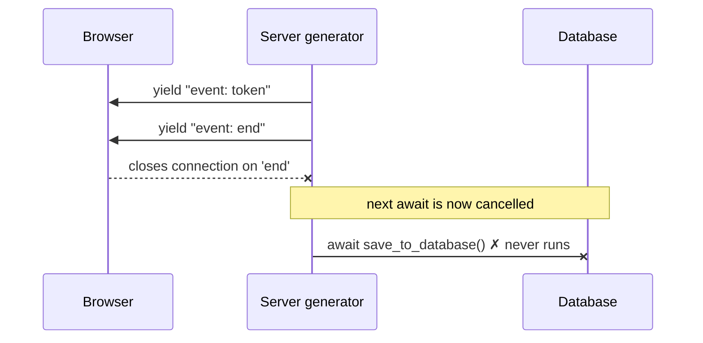

# SSE and Background Tasks

Part 0 was about what the agent *knows* — its state and the context reaching the model. Part 1 is about how its work *runs*, and the first rule is this: **the work must be able to outlive the HTTP request that started it.** Here is what breaks when it cannot.

## The problem: the user closes the tab, and the save never happens

An agent finishes a run. Your code streams a final `end` event to the browser, then saves the turn to the database. It works every time you test it — because you sit and watch the stream finish.

In production, the browser is not so patient. The moment it receives the `end` event, it closes the connection. That disconnect cancels your server code *before the save runs*. The user got their answer, the request returned `200 OK`, and the turn was never written to history. Nothing threw. Nothing logged. This is a [silent failure](00-glossary.md#transport-success-vs-semantic-success).

> **[SSE (Server-Sent Events)](00-glossary.md#sse-server-sent-events)** — a long-lived HTTP response where the server sends small text frames over time, instead of one final body. It is how an agent streams progress to a browser.

## What actually happens on disconnect

[SSE](00-glossary.md#sse-server-sent-events) is a generator on the server: it `yield`s frames, and between yields it `await`s. When the browser closes the connection, the server framework (Starlette, FastAPI) cancels that generator at its **next `await`**.



So any `await` placed *after* the terminal frame is a race against the client hanging up — and the client usually wins.

```python
# BEFORE — the save is cancelled before it starts
yield end_event
await save_to_database(...)   # the browser already left; this await never resolves
```

## The exception you will not catch

There is a second trap. When the framework cancels the generator, Python raises `asyncio.CancelledError`. In modern Python that inherits from `BaseException`, **not** `Exception`. So the usual safety net misses it entirely:

```python
try:
    await save_to_database(...)
except Exception:      # does NOT catch CancelledError
    logger.error("save failed")
```

The save is cancelled, the `except` never fires, and you have no log line telling you it happened.

## The fix: own the work before the terminal frame

Start the required work *before* you yield the terminal event, as a detached background task, and hold a strong reference so it is not garbage-collected mid-flight.

```python
ACTIVE_BACKGROUND_TASKS: set[asyncio.Task] = set()

async def stream():
    async for event in run_graph():
        if event.type == "end":
            task = asyncio.create_task(save_turn(event.turn))
            ACTIVE_BACKGROUND_TASKS.add(task)
            task.add_done_callback(ACTIVE_BACKGROUND_TASKS.discard)
        yield encode_sse(event)
```

This does not make the save infallible. It changes the failure mode from *"a client disconnect cancels the save before it starts"* to *"a background task owns its own completion and its own logging."* The task now runs to completion regardless of whether the browser is still listening.

## Test it with a forced disconnect

The happy-path test never catches this bug — you have to hang up early.

```text
1. Open the stream.
2. Read until the first terminal event.
3. Close the client connection immediately.
4. Assert the database save still completes.
5. Assert lock release still happens, or is safely skipped by its token check.
```

## Guardrails

- Treat a client disconnect as a first-class cancellation path, not an edge case
- Never place a required write after a terminal `yield`; start it before, as an owned task
- Remember `CancelledError` is a `BaseException` — a bare `except Exception` will not see it
- Propagate cancellation through every task boundary you spawn
- Test with forced early disconnects, not only happy-path streams

---
*Next: Part 2 begins with [Human-in-the-Loop Approval](08-human-in-the-loop-plan-approval.md). Now that a run can outlive its request, the agent needs to pause that run for a human to approve its plan before anything expensive executes. New term? See the [glossary](00-glossary.md).*
