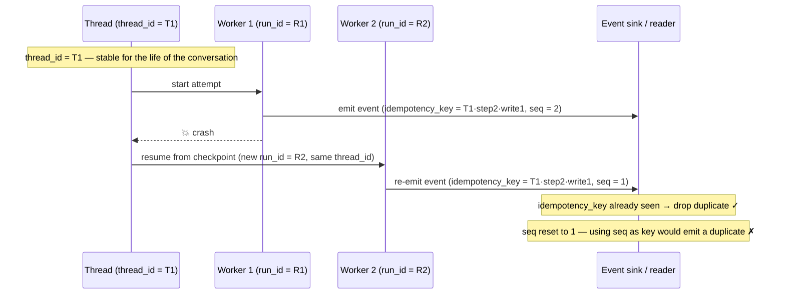
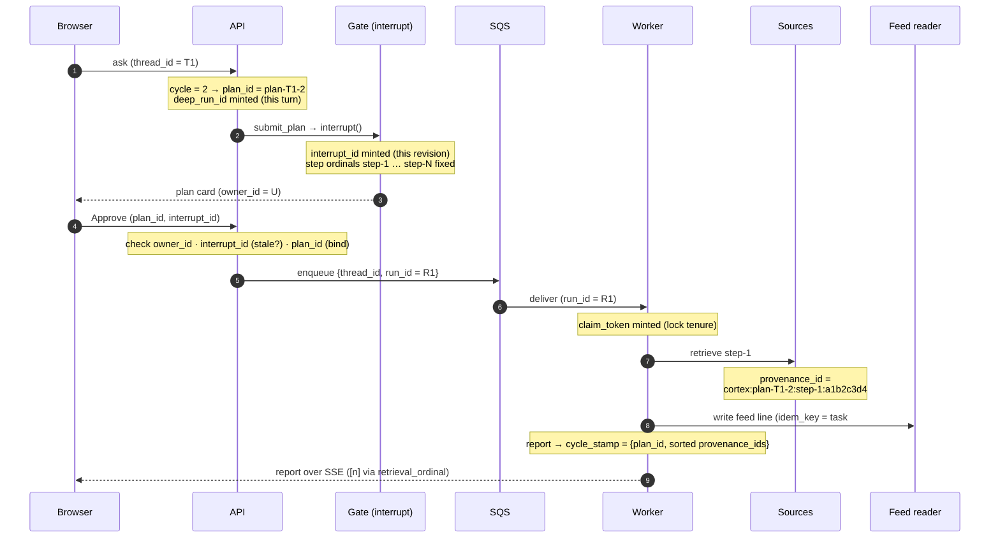

# Step 4 · Identifiers That Hold a Run Together

A worker crashes mid-run. A second worker picks the run up from its [checkpoint](00-glossary.md#checkpoint) and re-emits the events the first one already produced. The user's report ends up with two copies of every section. `200 OK`, no error, duplicated content — a [silent failure](00-glossary.md#transport-success-vs-semantic-success).

The cause is almost always the same: the code deduplicated events by their **[sequence number](00-glossary.md#sequence-number-seq)**, and on replay the sequence numbers came out different, so the reader thought the replayed events were new. The fix is not more code. It is understanding that a single run answers to *half a dozen different names*, each with a different job, and that using the wrong name for a job is its own class of bug.

This chapter is the map of those names. Everything after it in the series uses them; getting them straight here means the later articles read as "of course."

> All of these terms live in the [glossary](00-glossary.md) too. This article is where they connect.



## The four questions to ask of any identifier

For every id in the system, four questions settle what it is for:

1. **What does it identify?** A conversation? One attempt? A plan revision? A fact?
2. **What is its lifetime and scope?** Does it live for one request, one run, or forever?
3. **Is it stable across replay?** When a node re-runs from a checkpoint, does this id come back *identical*, or does it take a new value?
4. **What invariant does it guard?** What breaks if it is wrong?

Question 3 is the one that catches people, and it is the axis this whole chapter is organized around: **some ids must be identical on replay, and some must change on replay, and confusing the two is the duplicate-report bug above.**

## Follow one run: where each name appears

Before the categories, walk a single question end to end. Each identifier is *minted* at one hop and *checked* or *reused* at later ones — that hand-off is the whole point of having separate names.



Read the table top to bottom as one run's life; the sections after it are the deep dives.

| Hop in the run | Identifier in play | Minted or checked | Stable on replay? | What it buys you here |
|---|---|---|---|---|
| User opens a chat | `thread_id` | external, given | stable forever | Names the conversation; also the FIFO group key for one-worker-per-thread. |
| A new question arrives | `cycle` | bumped (+1) by the gate | stable once set | The question number within the thread. It is the ingredient that makes `plan_id` deterministic. |
| Model proposes a plan | `plan_id = plan-{thread}-{cycle}` · `deep_run_id` | both minted | `plan_id` stable · `deep_run_id` new per turn | `plan_id` is the approvable contract; `deep_run_id` stamps *this turn* so a stale plan is not re-persisted. |
| Plan is written | step `ordinal` (`step-1` … `step-N`) | assigned, fixed at lock | stable | "The result of step 2" means the same thing on every replay and in every citation. |
| Graph pauses at the gate | `interrupt_id` | minted | new per pause | Identifies the exact plan revision on screen — the stale-tab guard. |
| User clicks Approve | `owner_id` · `interrupt_id` · `plan_id` | all checked | — | Authorization, staleness, and plan-binding, in that order. |
| API enqueues to SQS | `run_id` | minted | new per attempt | Distinguishes this execution attempt from a later redelivery. |
| Worker claims the run | `claim_token` | minted | new per tenure | Fences the lock so a zombie worker cannot renew or delete it. |
| Each retrieval fires | `provenance_id = {source}:{plan_id}:{step_id}:{hash(sub_q)}` | minted | stable (deterministic) | Binds every fact to its retrieval; an identical retry reuses the id, so dedup is free. Note it *embeds* `plan_id` and the step ordinal. |
| Each feed line is written | `idem_key = {task_id}#{n}` · `seq` | minted | `idem_key` stable · `seq` new | `idem_key` lets the reader drop replayed lines; `seq` only orders them and is the cursor. |
| Exit writes the report | `cycle_stamp = {plan_id, sorted provenance_ids}` · `retrieval_ordinal` | minted | stable | The stamp blocks a duplicate report on redelivery; `retrieval_ordinal` maps each `[n]` citation back to its retrieval. |
| The whole way through | `trace_id` | minted once | — | Ties every log and span together for debugging. Never touches correctness. |

Two patterns fall out of reading it this way. First, **identity flows downstream**: `plan_id` is minted at proposal and then reappears inside `provenance_id` and `cycle_stamp` — the plan's name is literally a substring of the evidence's name and the report's name, which is what lets the exit path ask "does this evidence belong to this plan?" with a string compare. Second, **the stable-versus-new split alternates by purpose**: naming a *thing* (thread, plan, step, fact) is stable; naming an *attempt* at doing something (run, pause, lock tenure, stream position) is new. The rest of the chapter is those two patterns, one category at a time.

## Identity of the run: `thread_id` and `run_id`

- **[`thread_id`](00-glossary.md#thread-thread_id)** names one conversation — one logical timeline. It is stable forever. It is also the FIFO group key that makes ["one worker per thread"](08-queue-and-worker-execution.md) a property of the queue.
- **[`run_id`](00-glossary.md#run_id)** names one *attempt* to execute that thread's work. A thread can be run several times — an enqueue, a retry after a crash, a redelivery — and each attempt gets a fresh `run_id`.

The relationship is one-to-many: one `thread_id`, many `run_id`s over its life. Logs keyed only on `thread_id` cannot tell a retry from the original; logs keyed on `run_id` can.

## Identity of the plan: `plan_id`, `interrupt_id`, and the step ordinal

These three describe *what the human approved* and *which version of it*:

- **[`plan_id`](00-glossary.md#plan-plan_id-interrupt_id)** identifies the logical plan. It is **derived deterministically from the thread**, so re-running `submit_plan` on every resume rebuilds the *identical* id. A random id or a timestamp here would fork a new plan on every replay and break resume. (This is why the plan is a [projection](00-glossary.md#projection), covered in [HITL Approval](04-planning-and-human-approval.md).)
- **[`interrupt_id`](00-glossary.md#plan-plan_id-interrupt_id)** is minted fresh on every pause, so it identifies *the exact revision the user was looking at*. When two browser tabs both try to approve, the one holding a stale `interrupt_id` is rejected. This is the stale-tab check `plan_id` cannot provide by itself when the logical plan id stays stable across refinements.
- **[Ordinal id](00-glossary.md#ordinal-id)** is the stable position of a step *within* a locked plan — step 1, step 2, step 3. Once the plan is locked the ordinal is fixed, so "the result of step 2" means the same thing on every replay, in every report.

Note the split even here: `plan_id` and the step ordinal are **stable**; `interrupt_id` is **minted per pause**. Same object, different jobs, different stability.

## Identity for safe replay: idempotency key versus `seq`

This is the pair the opening bug is about, and the most important distinction in the chapter.

```text
A run is replayed after a crash. For each logical event:

  idempotency key  →  derived from EXECUTION POSITION
                      (which step, which logical write)
                      → IDENTICAL on replay  → reader dedupes correctly

  seq              →  a plain counter on the event stream
                      → NEW value on replay  → only good for ordering
```

- The **[idempotency key](00-glossary.md#idempotency-key)** answers "is this the same *logical* event I already saw?" Because it is built from *where in the execution* the event occurred, a replayed event carries the same key, and the reader drops the duplicate.
- The **[sequence number](00-glossary.md#sequence-number-seq)** (`seq`) answers "what order do these go in, and where is my cursor?" It takes new values on replay, which is fine for ordering — and fatal if you use it for identity.

> **The rule the whole system depends on: derive identity from execution *position*, never from the ordering counter.** Build the idempotency key from `seq` and you have written the duplicate-report bug. This is treated in depth in [Durable Async Runs](08-queue-and-worker-execution.md#sequence-number-versus-idempotency-key).

## Identity for ownership and locking: `owner_id` and `claim_token`

- **[`owner_id`](00-glossary.md#owner_id)** is *who* — the user who proposed the plan. It is checked on resume so one user cannot approve or resume another user's run. An authorization identity.
- **[`claim_token`](00-glossary.md#token)** is *this acquisition of the lock*. It is minted fresh each time a worker claims the run, and it identifies **the tenure, not the worker**. Every write to the claim is guarded by "only if the stored token still equals mine," so a worker that lost the claim can neither renew nor delete it. This is the fencing mechanism in [Distributed Locks](07-distributed-locks.md).

`claim_token` is another **changes-on-replay** id: a new acquisition is a new tenure, deliberately.

## Identity for truth and audit: `provenance id` and `trace_id`

The last pair is about trusting the output, not running it:

- **[Provenance id](00-glossary.md#provenance-id)** is a pointer from a *fact* back to the tool result that produced it — which `query_source` call a given figure in the report came from. It turns [grounding](00-glossary.md#grounding) from a promise into something *auditable*: every number carries the id of its retrieval, so a reviewer, or code, can confirm no figure was invented. In a regulated domain this is the difference between a quality issue and a compliance one.
- **[`trace_id`](00-glossary.md#trace_id)** ties every log line, span, and model call for one request together for the humans debugging later. Nothing in the run's *correctness* depends on it — it is pure observability.

### Why deep runs need provenance

Deep runs need provenance because their evidence is async, resumable, parallel, and reused across turns. A synchronous one-shot agent can treat "the list of tool results in memory" as the answer. A deep agent cannot:

- SQS can redeliver the same work; the report writer must recognize the same evidence set.
- `source_results` accumulates across turns; "all results in state" is not the same as "results for this question."
- Parallel retrievals can finish in one graph step; retries need deterministic deduplication.
- Citations, cards, charts, and activity logs all need to point to the exact retrieval that produced a fact.

### The deterministic provenance id

The production provenance id was deliberately deterministic:

```python
provenance_id = "{source}:{plan_id}:{step_id}:{sha1(sub_question)[:8]}"
# e.g. cortex:plan-thread-123-2:step-1:a1b2c3d4
```

An identical retry intentionally gets the same id. A changed clarification answer changes the sub-question hash, so the new retrieval gets a new id. Because the `plan_id` is embedded, the system can filter current-cycle evidence by rebuilding the id for the current plan and comparing strings, without relying on timestamps.

That filter is the small trick that keeps accumulating state usable:

```python
def current_cycle_results(plan, source_results):
    plan_id = plan["plan_id"]
    return [
        result
        for result in source_results
        if result["provenance_id"] == build_provenance_id(
            result["source"],
            plan_id,
            result["step_id"],
            result["sub_question"],
        )
    ]
```

The state can keep old evidence around for follow-ups, but the report path still has a deterministic answer to "which retrievals belong to this locked plan?" No timestamps, no "last N results," no destructive cleanup.

### The three ordinals

Three ordinal values sit next to provenance, and conflating them is a bug:

| Ordinal | 1-based index of | Scope | Purpose |
|---|---|---|---|
| `retrieval_ordinal` | The retrieval a citation marker like `[3]` points at | Per report | Maps inline citation markers back to `source_results`. |
| `source_ordinal` | The retrieval that produced a card or table | Per cycle | Join key on cards and tables so citations attach to the right retrieval. |
| `card["ordinal"]` | A card in the global display list | Per render | Display only. It is not a citation join key. |

The trap is that one retrieval can fan out into multiple cards. Display order and retrieval order then diverge, so joining citations to cards by display ordinal can attach a neighboring retrieval's card.

### Evidence-set identity: `cycle_stamp`

Finally, a deep report needs an evidence-set identity, not just an id per retrieval:

```python
cycle_stamp = {
    "plan_id": plan.plan_id,
    "provenance_ids": sorted({r.provenance_id for r in results}),
}
```

`reported_cycle` stores the stamp of the last delivered report; if an SQS redelivery reaches the exit path with the same stamp, report generation is a no-op. The comparison is whole-dict equality: same plan, same sorted set of provenance ids. On that idempotent branch the exit path should avoid even cosmetic writes such as a fresh chat label, because byte-identical retry behavior is the goal.

`chart_cycle` plays the same role for chart anchors. Chart specs are useful only for the evidence set they were built against; anchoring a new report against a stale catalog is just another way to make a correct-looking wrong answer. Comparing the same `cycle_stamp` before anchoring keeps chart references attached to same-cycle evidence.

This is why `cycle` and `cycle_stamp` are different ideas:

| Value | What it names | Why it exists |
|---|---|---|
| `cycle` | The question number within a thread | Feeds deterministic `plan_id` creation. |
| `plan_id` | The approved research contract for that cycle | Filters current-cycle evidence and binds approval. |
| `cycle_stamp` | The exact delivered evidence set | Blocks duplicate reports and stale chart anchors. |

## The whole map on one axis

The single most useful way to hold all of these is by the replay question:

| Stable across replay (identity) | New on replay (ordering / tenure) |
|---|---|
| `thread_id` — the conversation | `run_id` — the attempt |
| `plan_id` — the plan | `interrupt_id` — the pause |
| step **ordinal** — position in the plan | `seq` — stream order + cursor |
| **idempotency key** — the logical write | `claim_token` — the lock tenure |
| `owner_id`, `provenance id`, `trace_id` | |

When you reach for an id, ask which column it belongs in. If you need to recognize "the same thing" after a crash, it must come from the left column — and it must be derived from position, never from a counter.

---

!!! check "You should now understand"
    - Why a production run needs several identifiers, not one universal id
    - Which identifiers must stay stable across replay
    - Which identifiers must be new for each attempt, pause, or lock tenure
    - Why sequence numbers are good cursors but bad deduplication identities
    - Why provenance ids are part of correctness, not just observability

??? question "Try this"
    **A worker crashes after emitting two progress events. The replacement worker replays the same node and emits those same logical events again. Which value should the reader use to drop duplicates: `seq` or idempotency key? Why?**

    ??? success "Answer"
        Use the idempotency key. It is derived from execution position, so the replayed logical event gets the same key and can be deduplicated. `seq` is only the stream order and cursor. It can take new values on replay, so using it as identity turns replay into duplicate output.

*Next: [Step 5 · Streaming and Background Work](06-streaming-and-background-work.md) — now that the run's names are clear, make progress visible to the browser without letting the browser own completion.*
